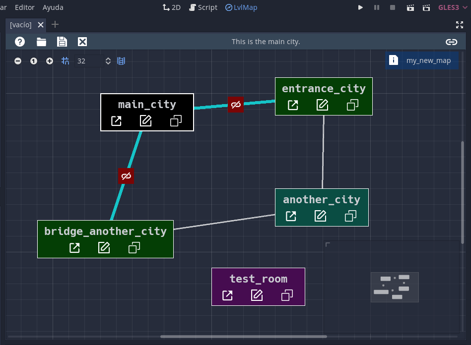

# GameLevels Blueprint
Create a blueprint in *Godot Engine* to organize levels/rooms of a game and their interconnections. **Useful for metroidvanias or non-linear games.**

***

I made this plugin in order to have a direct access to the scenarios [of my metroidvania game](https://dannygaray60.github.io/tn-oota.html). With this blueprint I can organize the scenarios and see where they should connect to.

**This blueprint has no functions beyond a visual representation of the general map of a game.**

***

# How to install
Just copy "gamelevels_blueprint" folder in your addons folder and enable from project settings.

***

### Working in Godot Engine 3.4.4

***

# How to use

Once you have activated the plugin, a new button called **LvlMap** will appear at the top of the editor, from here you can access the blueprint.

***

## Buttons located at the top:

1. About and Help button.
2. Open a map file.
3. Save the map file.
4. Close any open map file.

***

## Drag n' Drop

Now you can drag your scenes (.tscn) one by one to the blueprint:

***

## Editing Levels / Rooms

By pressing the center button of the scene, you can edit the chosen panel. You can replace the file it points to by another scene. Add a description or change the color of the panel.

From the same menu you can remove the scene from the blueprint (the file will not be removed from the game).

***

## Connecting Levels / Rooms

To connect rooms, click on the button located in the upper right corner, this will change the edit mode. Now just click on the scenes you want to connect.

When you select a scene, the lines that are connected will show a button with which you can delete the connection. These connections are also automatically deleted if you delete a scene.

*There are no connection limits, a scene can be connected to one, two, three or many scenes.*

**Note that connections have no additional function, they are just a way to represent the connection between scenarios.**

***

Each added scenario will show four buttons:

1. The first one will open the scenario in the editor (think of this as a shortcut). 

2. The second one will open the editor panel.

3. The third one will play the scene.

4. And the fourth button will copy the scenario path to the clipboard.

***

**Note: If the file pointed to by the panel does not exist, a flag (!) will be displayed and the open and copy path actions are disabled.**

***

You can save the blueprint in a lvlmap file. And work with several at the same time:

***

# Credits

This plugin was made by [Danny Garay](https://twitter.com/dannygaray60)

**Icons made by svgrepo.com**

Website
[https://dannygaray60.github.io/](https://dannygaray60.github.io/)

Email: [dannygaray60@gmail.com](mailto:dannygaray60@gmail.com)

Support me with a donation here
[https://ko-fi.com/dannygaray60](https://ko-fi.com/dannygaray60)
